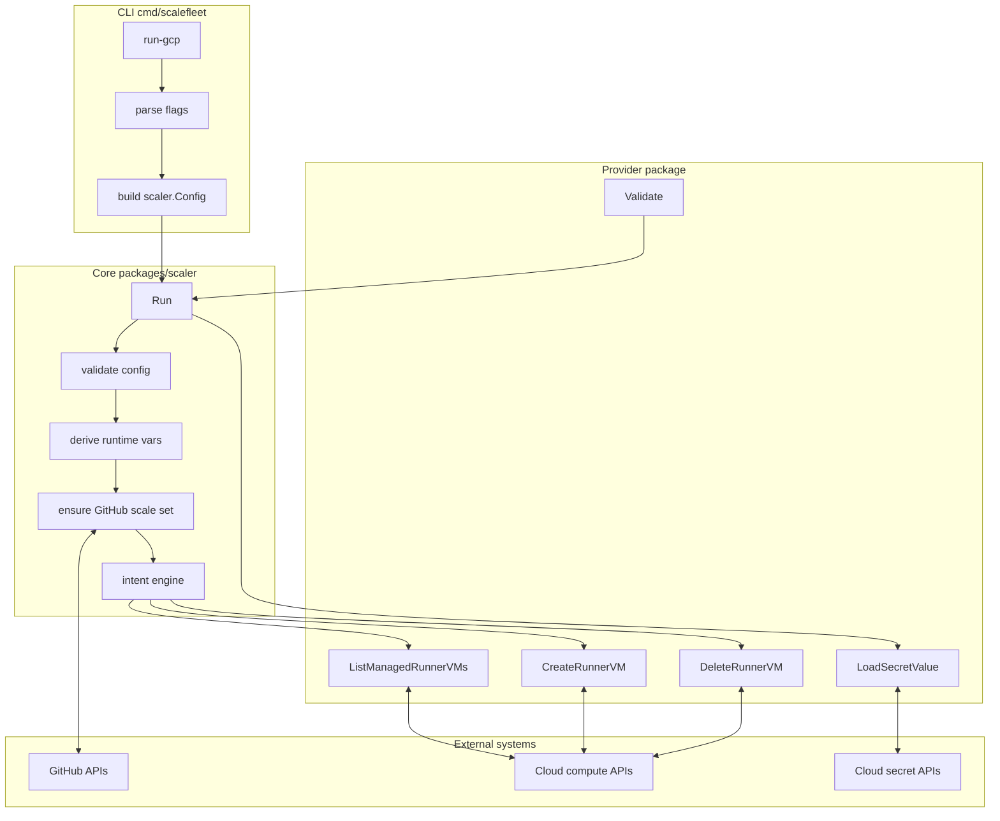
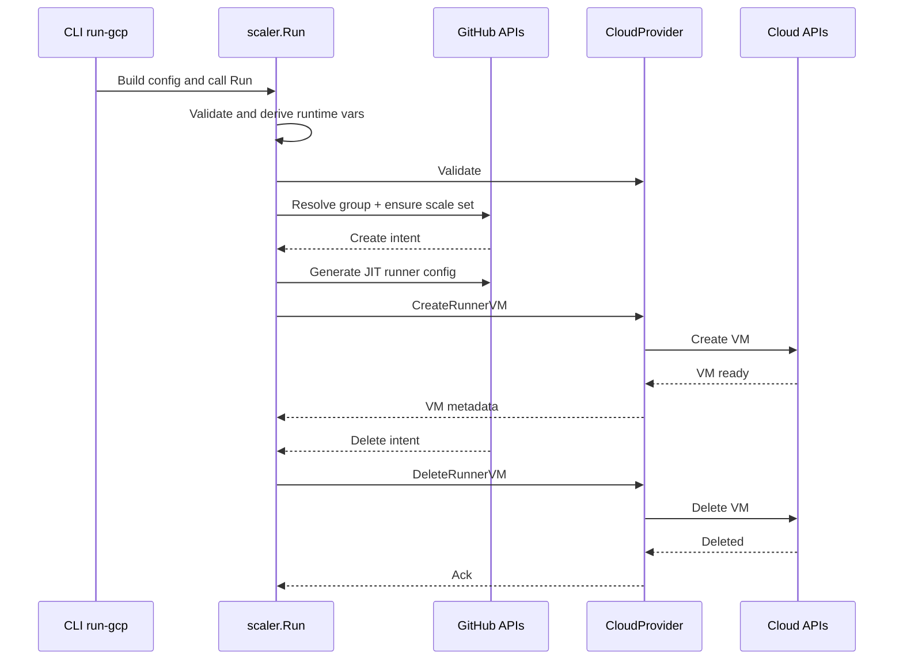

# scalefleet

`scalefleet` is a GitHub Actions runner autoscaler with a cloud-agnostic core and pluggable cloud providers.

## Architecture

### Core (`packages/scaler`)

- Owns reconciliation flow and runtime lifecycle.
- Integrates with `github.com/actions/scaleset` for runner scale set APIs and listener events.
- Defines the provider contract via `CloudProvider`.
- Applies safety checks for managed VM deletion and orphan sweeps.
- Centralizes retry/backoff policy for API operations.

### Provider (`packages/providers/<provider>`)

- Implements provider-specific VM and secret operations required by `CloudProvider`.
- Owns placement strategy and cloud API details.

### CLI (`cmd/scalefleet`)

- Exposes provider commands (`run-<provider>` pattern).
- Parses flags and builds `scaler.Config`.

### Component Diagram



### Runtime Sequence



## How It Works

1. Build config from CLI flags or library caller input.
2. Validate core config and provider config.
3. Derive runtime vars (`scaleSetName`, `runnerVMPrefix`, `runnerMaxRunDurationSeconds`).
4. Create GitHub scaleset client, resolve runner group, ensure scaleset.
5. Start listener and async intent engine.
6. Process create intents:
   - Generate JIT runner config.
   - Create VM through provider.
   - Confirm VM state.
7. Process delete intents:
   - Enforce managed-prefix and identity checks.
   - Optionally verify via scaleset runner lookup.
   - Delete VM through provider.
8. Run periodic orphan sweeper for managed VMs.

## What This Controller Does

- Creates or reuses repository-scoped runner scale sets.
- Reconciles desired GitHub runner count with managed cloud VMs.
- Creates runner VMs with JIT metadata.
- Deletes VMs when jobs complete.
- Sweeps orphaned managed VMs.
- Enforces hard runner VM runtime caps via provider scheduling.

## Current Status

- CLI commands:
  - `run-gcp`
- Provider implementations:
  - `gcp` (`packages/providers/gcp`)
- Planned:
  - `run-aws`
  - additional provider packages

## Contributors Wanted

Contributions are welcome for:

- New provider implementations (`packages/providers/<provider>`).
- New CLI provider commands (`run-<provider>` under `cmd/scalefleet`).
- Provider-level VM specification improvements and operational defaults.

If you are adding a new provider, use the GCP provider (`packages/providers/gcp`) as the reference implementation for:

- `CloudProvider` contract shape.
- Provider config validation approach.
- VM lifecycle operation patterns (list/create/delete).
- Provider-specific documentation layout.

## Repository Layout

- `cmd/scalefleet`
  - CLI commands and provider-specific flag wiring.
- `packages/scaler`
  - Cloud-agnostic core runtime and orchestration.
- `packages/providers/gcp`
  - GCP provider implementation and GCP-specific setup docs.

## Config Model

`scaler.Config` is the single runtime config object and includes:

- `Build`: controller identity metadata.
- `GitHub`: config URL and auth secret names.
- `Provider`: one `CloudProvider` implementation.
- `ScaleSet`: naming prefixes and max listeners.
- `Runtime`: retry/worker/timeout behavior.

Provider contract (`CloudProvider`) requires:

- `MachineType() string`
- `Validate() error`
- `RunnerMaxRunDuration() time.Duration`
- `ListManagedRunnerVMs(...)`
- `CreateRunnerVM(...)`
- `DeleteRunnerVM(...)`
- `LoadSecretValue(...)`

## CLI Model

- Command naming follows `run-<provider>`.
- Current command:
  - `run-gcp`
- Provider-specific flags and examples live with provider command docs.

## Library Usage

```go
package main

import (
	"context"

	"github.com/LexLuthr/scalefleet/packages/scaler"
)

func main() {
	cfg := scaler.DefaultConfig()

	// Supply one concrete provider config implementation.
	// Example: cfg.Provider = <your provider config>

	// Supply GitHub config/auth secret names.
	// Example: cfg.GitHub.ConfigURL = "https://github.com/org/repo"

	_ = scaler.Run(context.Background(), &cfg)
}
```

## Naming and Isolation

- Scale set name:
  - `<ScaleSet.NamePrefix>-<Provider.MachineType()>`
- Managed VM prefix:
  - `<ScaleSet.VMPrefix>-<Provider.MachineType()>`
- Runner names are generated from prefix + lowercase `uuid12`.
- Delete flow rejects non-managed prefix and identity mismatches.
- Orphan sweep targets only managed-prefix VMs and checks scaleset absence.

## Security Model

- Secrets are resolved at runtime via provider secret loading.
- CLI/config pass secret names, not secret values.
- Core and provider layers keep cloud concerns separated.
- Provider-specific network/security posture is documented in provider docs.

## Build, Test, Validate

Build:

```bash
go build -o scalefleet ./cmd/scalefleet
```

Tests:

```bash
go test ./...
```

Validation checklist:

1. Controller starts and authenticates.
2. Scale set is created/reused.
3. Workflow demand triggers create intents.
4. Runner VMs register and execute jobs.
5. Job completion triggers delete intents.
6. No stale managed VMs remain beyond grace/runtime windows.

## Troubleshooting

- Scale set setup fails:
  - Verify GitHub config URL, auth mode, secret names, and repo permissions.
- Auth failures:
  - Verify provider secret loading permissions and secret names.
- VM lifecycle failures:
  - Verify provider config and cloud capacity/permissions.
- Jobs not routing:
  - Verify workflow labels and derived scale set name.

## Provider Documentation

- GCP provider setup and prerequisites:
  - `packages/providers/gcp/README.md`

## Roadmap

- Expand GCP provider to accept VM specification from user config.
- Add AWS provider.
- Add Azure provider.
- Add DigitalOcean provider.
